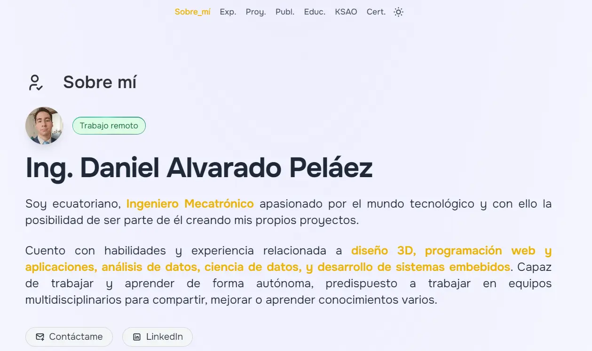

# Mi portafolio

### Descripción:

Portafolio que muestre mi experiencia, proyectos, habilidades y demas a modo de web.
Adaptación un temple de desarrollado por Midudev, para realizar un portafolio que muestre mi CV a modo de web.

<div align="center">

[GitHub de Midudev](https://github.com/midudev)

</div>

### Link al sitio web:

<div align="center">

[Mi portafolio](https://daap213.github.io/Portafolio_Astro/)

</div>

<div align="center">
<a href="https://daap213.github.io/Portafolio_Astro/">

</a>
</div>

<div align="center">


</div>

### Comando para generar QR de proyectos

```http
  npm run GQR
```

Las imagenes Qr se guardan en public/img/qr

### Comando para generar pdf del CV

```http
  npm run GPDF
```

Los pdf de las vistas se guardan en public/docs de config/prod/URLWEB:
