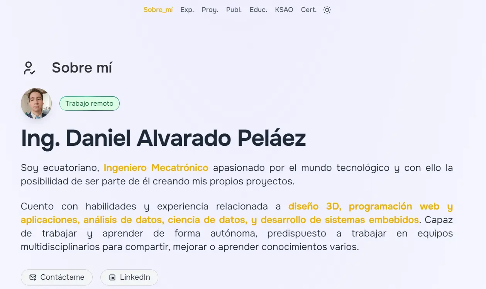

# Mi portafolio

### Descripción:

Portafolio que muestra mi experiencia, proyectos, habilidades y demás a modo de web.
Adaptación de una plantilla desarrollada por Midudev, para realizar un portafolio que muestre mi CV a modo de web.

<div align="center">

[GitHub de Midudev](https://github.com/midudev)

</div>

### Link al sitio web:

<div align="center">

[Mi portafolio](https://portafolio.daaptech.org/)

</div>

<div align="center">
<a href="https://portafolio.daaptech.org/">

</a>
</div>

<div align="center">


</div>

## Stack

- **Astro 7** — sitio estático bilingüe (es/en), sin islas de framework ni backend.
- **Tailwind CSS v4** — sin `tailwind.config.*`: toda la configuración vive en `src/styles/global.css` y se conecta con `@tailwindcss/vite` (no PostCSS).
- **TypeScript 7**.
- **pnpm** — la versión se fija en el campo `packageManager` y `pnpm-lock.yaml` está versionado.
- **Vitest + Playwright** — suite de tests unitarios, de build y end-to-end.
- **Puppeteer** (PDF del CV) y **qrcode** (QR de proyectos).
- Despliegue en **Cloudflare Pages** (integración Git configurada fuera del repositorio).

La rama activa es `cloud_version`: es la que despliega y sobre la que corren los workflows.

## Requisitos

- Node.js >= 22.12 (Astro 7).
- pnpm (`corepack enable` respeta la versión declarada en `package.json`).

```bash
pnpm install
```

El postinstall de puppeteer está desactivado en `pnpm-workspace.yaml`, así que Chrome no se descarga al instalar. Solo hace falta para generar los PDF o correr sus tests:

```bash
pnpm exec puppeteer browsers install chrome
```

## Comandos

| Comando | Qué hace |
| --- | --- |
| `pnpm run dev` | Servidor de desarrollo en `:4321` |
| `pnpm run build` | Genera el sitio en `dist/` |
| `pnpm run preview` | Sirve `dist/` en `:4321` |
| `pnpm run test` | Tests unitarios (datos, config, claves de traducción, componentes) |
| `pnpm run test:build` | Comprueba el contenido de `dist/` (requiere `build` previo) |
| `pnpm run test:scripts` | Genera QR y PDF de verdad (requiere `dist/` y Chrome) |
| `pnpm run test:e2e` | Tests end-to-end con Playwright (requiere `dist/`) |
| `pnpm run GQR` | Regenera los QR en `public/img/qr` |
| `pnpm run GPDF` | Imprime `/es/cv` y `/en/cv` a `public/docs` |

Para un solo fichero: `pnpm exec vitest run tests/unit/qr-sync.test.js`, `pnpm exec playwright test tests/e2e/cv.spec.ts`.

### Generar los QR de proyectos

```bash
pnpm run GQR
```

Las imágenes QR se guardan en `public/img/qr`. Los nombres se derivan del **título en español** del proyecto, y los datos en inglés reutilizan esos mismos ficheros: al renombrar un proyecto hay que regenerarlos y actualizar el campo `qr` en los dos idiomas.

### Generar los PDF del CV

```bash
pnpm exec astro preview --background
pnpm run GPDF
pnpm exec astro preview stop
```

Los PDF se guardan en `public/docs` (`CV_ESP.pdf` y `CV_EN.pdf`) y se versionan en el repositorio. `GPDF` imprime desde `http://localhost:4321`, por eso hace falta un servidor levantado; con `PROD=true` imprime desde el sitio en producción.

> Desde Astro 7 el `preview` es un demonio: se arranca con `--background` y se detiene con `astro preview stop` (matar el proceso no lo da de baja).

## Estructura

```
src/
  cv_info/
    cv.js        # única fuente de datos: objetos `es` y `en` con la misma forma
    es.js|en.js  # capa de presentación: navItems, footerInfor, ui, pagIndex
  components/    # icons/, otros/, seccions/
  layouts/       # Layout.astro
  pages/
    es|en/index.astro  # renderizan las secciones de pagIndex
    es|en/cv.astro     # vistas del CV, HTML autónomo con CSS de impresión
  scripts/       # url_to_qr.js (QR) y pdf_cv.js (PDF)
  styles/        # global.css (config de Tailwind v4)
public/
  docs/          # PDF del CV generados
  img/qr/        # QR generados
config.js        # rutas base de prod y dev
```

Añadir, quitar o reordenar secciones de la home se hace en `seccionItems` (`es.js` y `en.js`); las páginas casi nunca cambian.

## Flujo para actualizar el contenido

1. Editar `src/cv_info/cv.js` — **los dos idiomas**, `es` y `en`.
2. `pnpm run GQR` si cambió alguna URL o el título en español de un proyecto.
3. `pnpm run test` — detecta desincronización es/en, recursos que faltan y QR desactualizados.
4. `pnpm run build && pnpm run test:build`, y opcionalmente regenerar los PDF con el preview levantado.
5. Commit a `cloud_version` (el CI regenera los PDF igualmente).

## Tests

- `tests/unit/` — no necesita build: importa los datos y renderiza componentes con la Container API de Astro. Vigila la paridad es/en, las claves de traducción (`ui.*`) y que los QR versionados coincidan byte a byte con los que produce el script.
- `tests/build/` — comprueba las páginas generadas y que todo `src`/`href` local exista en `dist/`.
- `tests/scripts/` — ejecución real de `GQR` y `GPDF`.
- `tests/e2e/` — Playwright: tema claro/oscuro, cambio de idioma, anclas del menú, imágenes y PDF enlazados.

No hay paso de `astro check`: TypeScript 7 aún no expone una API programática estable y el type-checker de plantillas de Astro no puede correr sobre él ([withastro/astro#17268](https://github.com/withastro/astro/issues/17268)). La suite de tests hace de red de seguridad mientras tanto.

## CI/CD

- **`ci.yml`** — suite completa (unitarios → build → assertions sobre `dist/` → GQR/GPDF → Playwright). Se dispara en `pull_request` y por `workflow_call`.
- **`deploy.yml`** — en cada push a `cloud_version` llama a `ci.yml`; si además cambiaron `cv.js` o los `cv.astro`, regenera los PDF y los commitea de vuelta (los commits `Update PDFs`). El despliegue en sí lo hace Cloudflare Pages.
- **`codeql.yml`** — análisis CodeQL en push/PR a `cloud_version` y semanalmente.
- **`dependabot.yml`** — dependencias npm (semanal) y GitHub Actions (mensual) contra `cloud_version`, así sus PR pasan por el CI antes de fusionarse.
